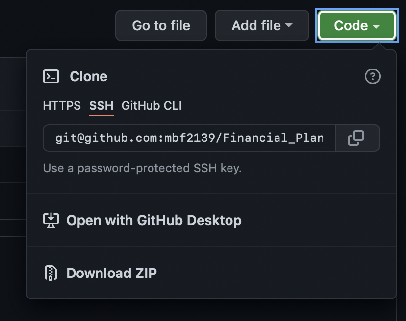
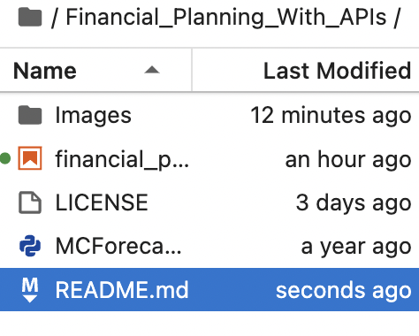

# Financial_Planning_With_APIs
Financial Planner for Two Scenarios - Emergencies and Retirement

## Technologies

This app leverages python 3.7 with the followung technologies:

* [pandas](https://github.com/pandas-dev/pandas) - For data analysis and manipulation.
* [Alpaca Trade API](https://alpaca.markets) - For stock and bond data
* [matplotlib_inline](https://github.com/ipython/matplotlib-inline) - For data visualizations.

--- 
## Installation

1. Clone the repo 

2. Before running the program make sure to install the following dependencies:

            '''
            python
            conda install -c anaconda requests
            conda install -c jmcmurray json
            pip install python-dotenv
            pip install alpaca-trade-api
            '''

3. In order to access data via the [Alpaca Trade API](https://alpaca.markets) the user will need to create an account, generate their API keys, and save them into a dotenv file

4. Once the keys have been placed in the file, they can loaded into the program using the following code:
            
            '''
            alpaca_api_key = os.getenv("ALPACA_API_KEY")
            alpaca_secret_key = os.getenv("ALPACA_SECRET_KEY")
            '''
---

## Usage

1. To use the Crypto Arbitrage application navigate to the  the repo and run the ***financial_planning_tools.ipynb*** file

2. In the ***MCForecastTools.py*** the user will find the script neccesary to run the simulations in Part 2 of the financial planning program 

3. The user can adjust the program to their specifications by customizing their API calls to reflect their own portfolio data

---

## Contributors

The starter code was contributed by the [FinTech Bootcamp at Columbia Engineering](https://bootcamp.cvn.columbia.edu/fintech/)

Matthew Field finalized the application, his work is availble to view on [Github](https://github.com/mbf2139)

---

## License

MIT